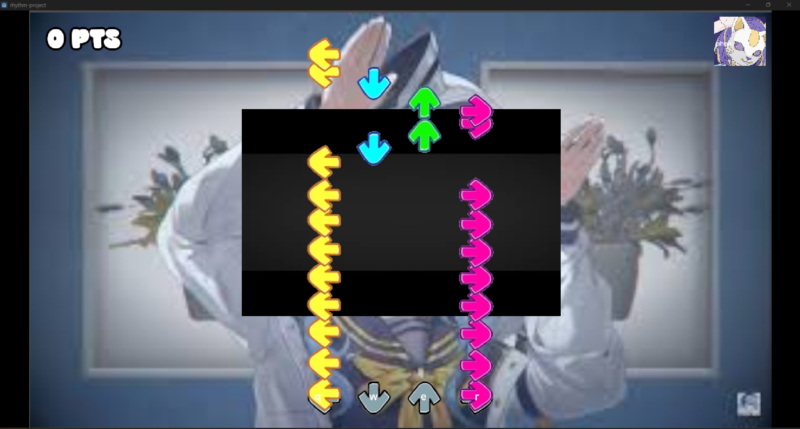
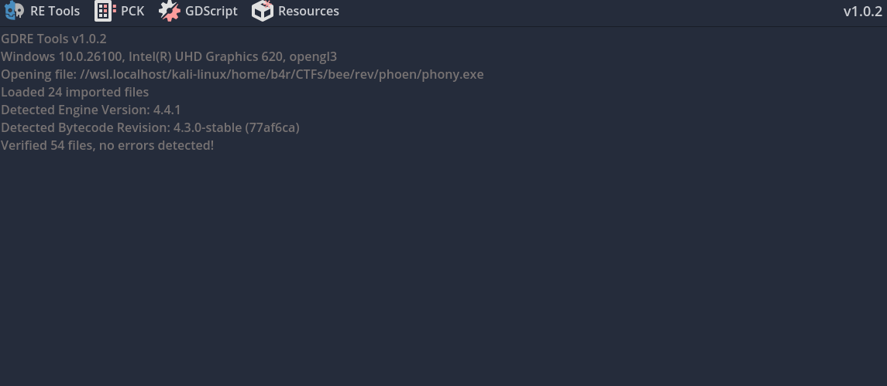
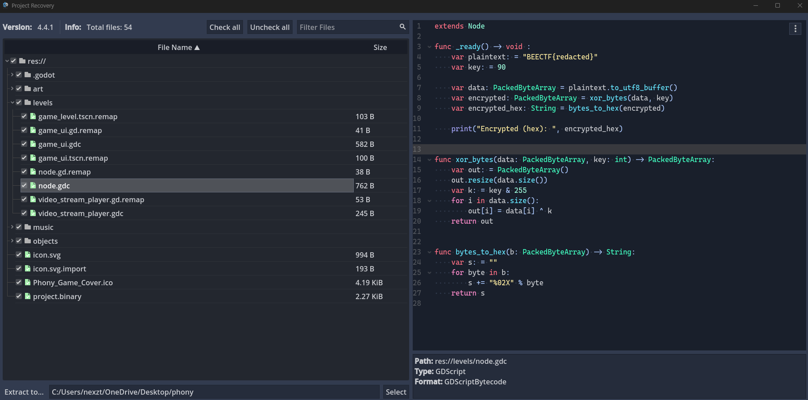
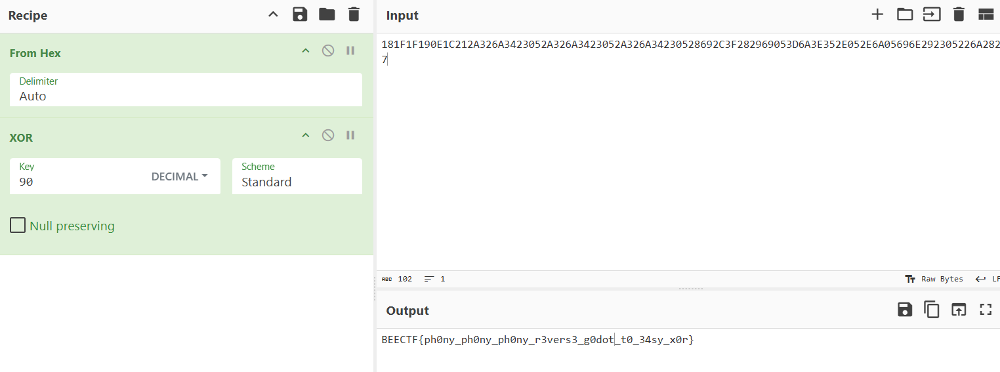

Jadi di minggu lalu, gw mengikuti lomba Capture The Flag yang diadakan oleh BINUS, disalah satu challenge Reverse Engineering nya, terdapat satu chall Game Hacking, 





Disini sepertinya, kita perlu untuk meraih skor tertentu untuk mendapatkan flag nya, tapi karna sesuai category challnya, yaitu Reverse Engineering, gw nyoba untuk RE. Awalnya pake Ghidra untuk static analysis nya, tapi karna file bawaan Godot ini banyak, jadinya agak lama dan akhirnya gw ganti tools RE yang lebih berfokus ke Godot, yaitu GDRE https://github.com/GDRETools/gdsdecomp




Pilih opsi RE Tools dan buka file .exe dari game tersebut

Nah nanti akan ada preview nya dari source code game tersebut, dan bisa dilihat, di 



```gdscript
extends Node

func _ready() -> void :
    var plaintext: = "BEECTF{redacted}"
    var key: = 90

    var data: PackedByteArray = plaintext.to_utf8_buffer()
    var encrypted: PackedByteArray = xor_bytes(data, key)
    var encrypted_hex: String = bytes_to_hex(encrypted)

    print("Encrypted (hex): ", encrypted_hex)


func xor_bytes(data: PackedByteArray, key: int) -> PackedByteArray:
    var out: = PackedByteArray()
    out.resize(data.size())
    var k: = key & 255
    for i in data.size():
        out[i] = data[i] ^ k
    return out


func bytes_to_hex(b: PackedByteArray) -> String:
    var s: = ""
    for byte in b:
        s += "%02X" % byte
    return s
```

terdapat sebuah function untuk mengenkripsi sebuah plaintext menggunakan XOR dengan key 90, dan juga bisa dilihat di direktori `.godot/exported/133200997` terdapat file yang berfungsi sebagai pengatur bagian leve dari game tersebut

```gdscript
[gd_scene load_steps=10 format=4 uid="uid://b8f1ign6hpicr"]

[ext_resource type="Texture2D" uid="uid://dlkgqrkm05kis" path="res://art/wall.jpg" id="1"]
[ext_resource type="Texture2D" uid="uid://ceej6m0qbc7ph" path="res://art/bg.jpg" id="2"]
[ext_resource type="VideoStream" uid="uid://bdn6kuj11y6wh" path="res://art/output.ogv" id="3"]
[ext_resource type="Script" uid="uid://bal7spqboqpht" path="res://levels/video_stream_player.gd" id="4"]
[ext_resource type="PackedScene" uid="uid://dfdglmltorqae" path="res://objects/key_listener.tscn" id="5"]
[ext_resource type="PackedScene" uid="uid://dpc13ucm0i8fg" path="res://levels/game_ui.tscn" id="6"]
[ext_resource type="PackedScene" uid="uid://coqj034dvvbeu" path="res://objects/level_editor.tscn" id="7"]
[ext_resource type="Script" uid="uid://eo4ip2x6grmq" path="res://levels/node.gd" id="8"]

[sub_resource type="Environment" id="Environment_i5mjo"]
background_mode = 3
glow_enabled = true
glow_blend_mode = 1

[node name="GameLevel" type="Node2D"]

[node name="Camera2D" type="Camera2D" parent="."]

[node name="Wall" type="Sprite2D" parent="."]
position = Vector2(0.874969, 1.32999)
scale = Vector2(3.84083, 3.84131)
texture = ExtResource("1")

[node name="Bg" type="Sprite2D" parent="."]
position = Vector2(527, -276)
scale = Vector2(0.265, 0.253333)
texture = ExtResource("2")

[node name="VideoStreamPlayer" type="VideoStreamPlayer" parent="."]
offset_left = -246.0
offset_top = -171.0
offset_right = 249.0
offset_bottom = 151.0
stream = ExtResource("3")
autoplay = true
expand = true
script = ExtResource("4")

[node name="KeyListener" parent="." node_paths=PackedStringArray("falling_key_container", "score_text_container") instance=ExtResource("5")]
position = Vector2(-120, 280)
key_name = "button_Q"
falling_key_container = NodePath("../FallingKeysContainer")
score_text_container = NodePath("../ScoreTextContainer")

[node name="KeyListener2" parent="." node_paths=PackedStringArray("falling_key_container", "score_text_container") instance=ExtResource("5")]
position = Vector2(-40, 280)
frame = 1
key_name = "button_W"
falling_key_container = NodePath("../FallingKeysContainer")
score_text_container = NodePath("../ScoreTextContainer")

[node name="KeyListener3" parent="." node_paths=PackedStringArray("falling_key_container", "score_text_container") instance=ExtResource("5")]
position = Vector2(40, 280)
frame = 2
key_name = "button_E"
falling_key_container = NodePath("../FallingKeysContainer")
score_text_container = NodePath("../ScoreTextContainer")

[node name="KeyListener4" parent="." node_paths=PackedStringArray("falling_key_container", "score_text_container") instance=ExtResource("5")]
position = Vector2(120, 280)
frame = 3
key_name = "button_R"
falling_key_container = NodePath("../FallingKeysContainer")
score_text_container = NodePath("../ScoreTextContainer")

[node name="GameUI" parent="." instance=ExtResource("6")]

[node name="WorldEnvironment" type="WorldEnvironment" parent="."]
environment = SubResource("Environment_i5mjo")

[node name="LevelEditor" parent="." instance=ExtResource("7")]

[node name="FallingKeysContainer" type="Node2D" parent="."]

[node name="ScoreTextContainer" type="Node2D" parent="."]

[node name="RichTextLabel2" type="RichTextLabel" parent="."]
offset_left = -133.0
offset_top = 263.0
offset_right = 133.0
offset_bottom = 287.0
text = "q                  w                e                  r"
scroll_active = false

[node name="IniKahMyKisahEhIMeanMyFlag" type="RichTextLabel" parent="."]
visible = false
offset_left = 592.0
offset_top = -319.0
offset_right = 668.0
offset_bottom = -295.0
text = "181F1F190E1C212A326A3423052A326A3423052A326A34230528692C3F282969053D6A3E352E052E6A05696E292305226A2827"
scroll_active = false

[node name="Node" type="Node" parent="."]
script = ExtResource("8")
```
encrypted nya ada di node `IniKahMyKisahEhIMeanMyFlag`

```gdbscript
text = "181F1F190E1C212A326A3423052A326A3423052A326A34230528692C3F282969053D6A3E352E052E6A05696E292305226A2827"
```

Dan yaudah tinggal decrypt aja, kalo pake cyberchef, gini recipe nya:
```txt
From Hex
XOR (Key: 90 Decimal)
```



