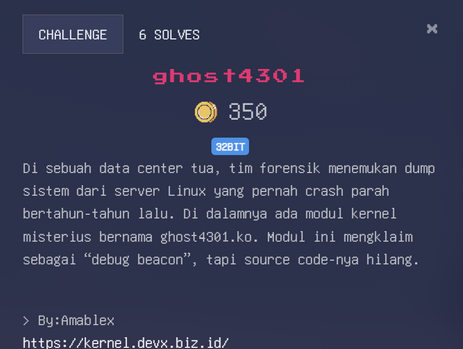
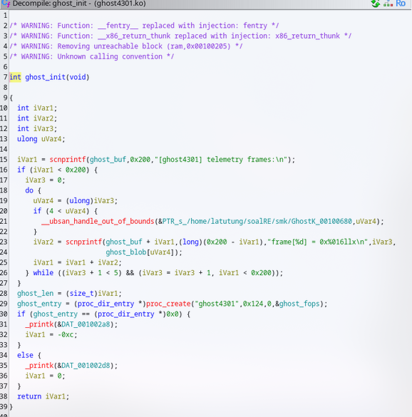
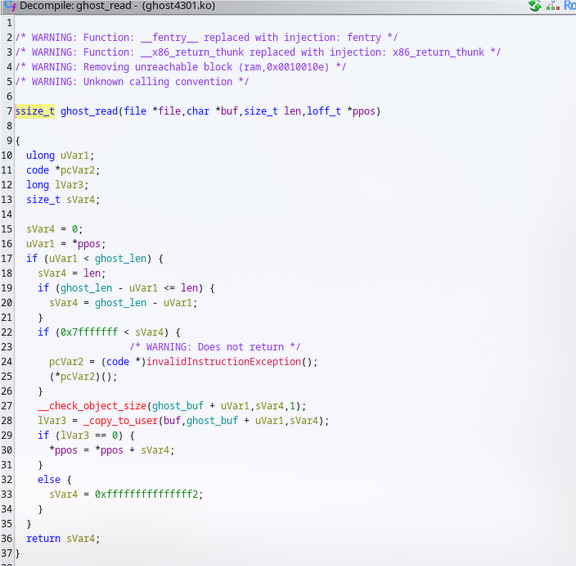
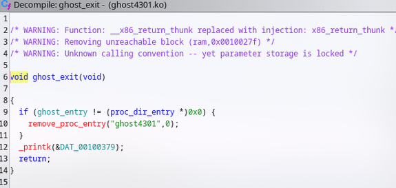
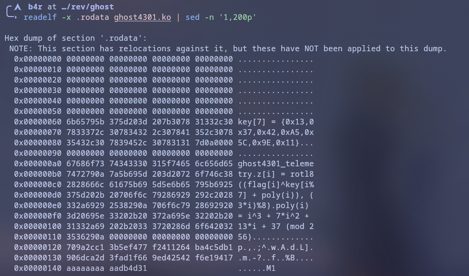
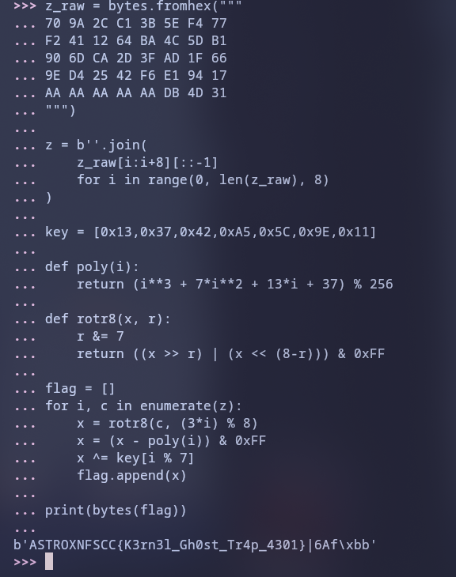

# Walkthrough

Diberikan sebuah binary `.ko` (kernel), langsung gw decompile 









```c
ssize_t __pfx_ghost_read(struct file* file, char* buf, size_t len, loff_t* ppos)
{
    /* tailcall */
    return ghost_exit(file, buf, len, ppos);
}

ssize_t ghost_exit(struct file* file, char* buf, size_t len, loff_t* ppos)
{
    int64_t rcx_1;
    int64_t rdx_2;
    int64_t rsi_2;
    rcx_1 = __fentry__();
    simple_read_from_buffer(rsi_2, rdx_2, rcx_1, &ghost_buf, ghost_len);
    /* tailcall */
    return __x86_return_thunk(0, 0, 0, 0, 0);
}

int64_t __pfx_ghost_init()
{
    /* tailcall */
    return ghost_init();
}

int64_t ghost_init()
{
    __fentry__();
    int32_t i_1 = scnprintf(&ghost_buf, 0x200, "[ghost4301] telemetry frames:\n");
    int32_t i = i_1;
    
    if (i_1 <= 0x1fe)
    {
        int32_t r12_1 = 0;
        
        do
        {
            int64_t r14_1 = r12_1;
            
            if (r14_1 >= 5)
                __ubsan_handle_out_of_bounds(&data_400680, r14_1);
            
            uint64_t rcx_1 = r12_1;
            r12_1 += 1;
            i += scnprintf(i + &ghost_buf, 0x200 - i, "frame[%d] = 0x%016llx\n", rcx_1, 
                *((r14_1 << 3) + &ghost_blob));
            
            if (r12_1 > 4)
                break;
        } while (i <= 0x1fe);
    }
    
    ghost_len = i;
    uint64_t rax_1 = proc_create("ghost4301", 0x124, 0, &ghost_fops);
    ghost_entry = rax_1;
    
    if (!rax_1)
        _printk(0x400210, "ghost4301");
    else
    {
        _printk(0x4002b1, 
            "ghost4301_telemetry\nz[i] = rotl8((flag[i]^key[i%7] + poly(i)), (3*i)%8)\npoly(i) = i^3 + "
        "7*i^2 + 13*i + 37 (mod 256)\n");
        _printk(0x4002b1, "key[7] = {0x13,0x37,0x42,0xA5,0x5C,0x9E,0x11}\n");
        _printk(0x400238, "ghost4301");
    }
    
    /* tailcall */
    return __x86_return_thunk(0, 0, 0, 0, 0);
}

int64_t __pfx_cleanup_module()
{
    /* tailcall */
    return cleanup_module();
}

int64_t cleanup_module()
{
    if (ghost_entry)
        remove_proc_entry("ghost4301", 0);
    
    _printk(0x4002c1);
    /* tailcall */
    return __x86_return_thunk(0, 0);
}
```



Dari dump kita menemukan array key

```c
key[7] = {0x13,0x37,0x42,0xA5,0x5C,0x9E,0x11}
```
dan juga rumus encryption nya
```c
tmp = flag[i] ^ key[i%7]
tmp = (tmp + poly(i)) & 0xFF
cipher[i] = rotl8(tmp, (3*i) % 8)
```
Dan dari ciphertext yang kita ekstrak dari .rodata, di bawah string-string itu ada blok 40 byte:
```c
709A2CC13B5EF477
F2411264BA4C5DB1
906DCA2D3FAD1F66
9ED42542F6E19417
AAAAAAA A AADB4D31
```

Yauds tinggal buat solver
```py
z_raw = bytes.fromhex("""
70 9A 2C C1 3B 5E F4 77
F2 41 12 64 BA 4C 5D B1
90 6D CA 2D 3F AD 1F 66
9E D4 25 42 F6 E1 94 17
AA AA AA AA AA DB 4D 31
""")
key = [0x13,0x37,0x42,0xA5,0x5C,0x9E,0x11]

def poly(i):
    return (i**3 + 7*i**2 + 13*i + 37) % 256

def rotr8(x, r):
    r &= 7
    return ((x >> r) | (x << (8-r))) & 0xFF

flag = []
for i, c in enumerate(z):
    x = rotr8(c, (3*i) % 8)
    x = (x - poly(i)) & 0xFF
    x ^= key[i % 7]
    flag.append(x)

print(bytes(flag))
```

Tetapi outputnya masi anomali (ga segampang itu ternyata), dan gw memutuskan untuk mencoba dengan reverse tapi per frame
```py
z = b''.join(
    z_raw[i:i+8][::-1]
    for i in range(0, len(z_raw), 8)
)
```
Jadi kayak gini final solver nya
```py
z_raw = bytes.fromhex("""
70 9A 2C C1 3B 5E F4 77
F2 41 12 64 BA 4C 5D B1
90 6D CA 2D 3F AD 1F 66
9E D4 25 42 F6 E1 94 17
AA AA AA AA AA DB 4D 31
""")

z = b''.join(
    z_raw[i:i+8][::-1]
    for i in range(0, len(z_raw), 8)
)

key = [0x13,0x37,0x42,0xA5,0x5C,0x9E,0x11]

def poly(i):
    return (i**3 + 7*i**2 + 13*i + 37) % 256

def rotr8(x, r):
    r &= 7
    return ((x >> r) | (x << (8-r))) & 0xFF

flag = []
for i, c in enumerate(z):
    x = rotr8(c, (3*i) % 8)
    x = (x - poly(i)) & 0xFF
    x ^= key[i % 7]
    flag.append(x)

print(bytes(flag))
```



