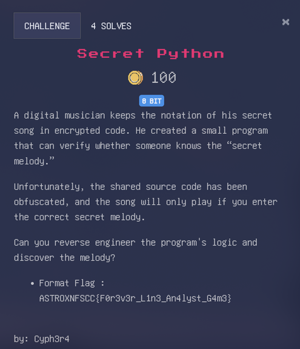
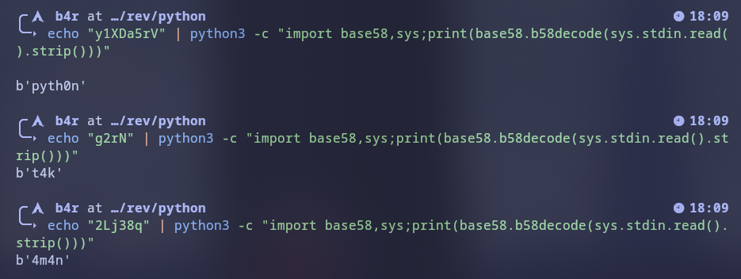

# Walkthrough

Diberikan sebuah file `.pyc` (python compiled), langsung gw decompile menggunakan pylingual

```py
def validate(user_input):
    user_input = [ord(c) ^ 69 for c in 'pyth0n_v4r14bl3s']
    return all((ord(user_input[i]) ^ 69 == key[i] for i in range(len(user_input))))

def main():
    inp = input('Enter passcode: ')
    if validate(inp):
        print("\nIn the vast world of code,\ny1XDa5rV is here, a clear language.\nEasy to learn, friendly to everyone,\nFrom beginners to experts.\n\nPython, Python, the language we've been waiting for,\nFor web, data, and innovation.\nIts syntax is clear, its flow is neat,\nMaking life more meaningful.\n\nLibraries and frameworks, its power,\nPandas, NumPy, for data analysis.\nTensorFlow, PyTorch, in the realm of AI,\nPython, Python, nothing can match.\n\nPython, Python, the language we've been waiting for,\nFor web, data, and innovation.\nIts syntax is clear, its flow is neat,\nMaking life more meaningful.\n\nFrom small projects to large ones,\nPython is always there, g2rN was never rough.\nInterpreted, run line by line,\nErrors are easily detected, avoid tears.\n\nPython, Python, the language you've been waiting for,\nFor the web, data, and innovation.\nClear syntax, neat flow,\nMakes life more 2Lj38q.\n")
    return None
if __name__ == '__main__':
    main()
```

## Penjelasan binary
Jadi program ini dia cuman minta input dan kalo input yang dimasukan itu "pyth0n_v4r14bl3s" dia bakalan ngeprint 

```
In the vast world of code,
y1XDa5rV is here, a clear language.
Easy to learn, friendly to everyone,
From beginners to experts.

Python, Python, the language we've been waiting for,
For web, data, and innovation.
Its syntax is clear, its flow is neat,
Making life more meaningful.

Libraries and frameworks, its power,
Pandas, NumPy, for data analysis.
TensorFlow, PyTorch, in the realm of AI,
Python, Python, nothing can match.

Python, Python, the language we've been waiting for,
For web, data, and innovation.
Its syntax is clear, its flow is neat,
Making life more meaningful.

From small projects to large ones,
Python is always there, g2rN was never rough.
Interpreted, run line by line,
Errors are easily detected, avoid tears.

Python, Python, the language you've been waiting for,
For the web, data, and innovation.
Clear syntax, neat flow,
Makes life more 2Lj38q.
```

nah yang menarik disini itu ada kaliamt yang terlihat seperti ciphertext, yaitu `y1XDa5rV`, `g2rN` dan `2Lj38q`. 


disini gw coba ngeidentifikasi cipher nya, dan salah satu kandidat nya itu adalah base58, 


