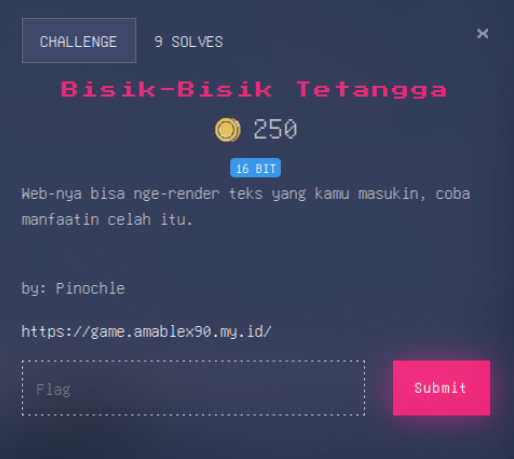
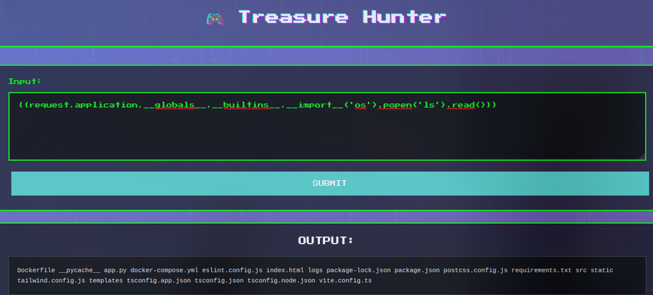
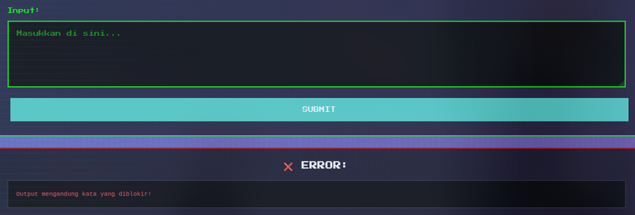
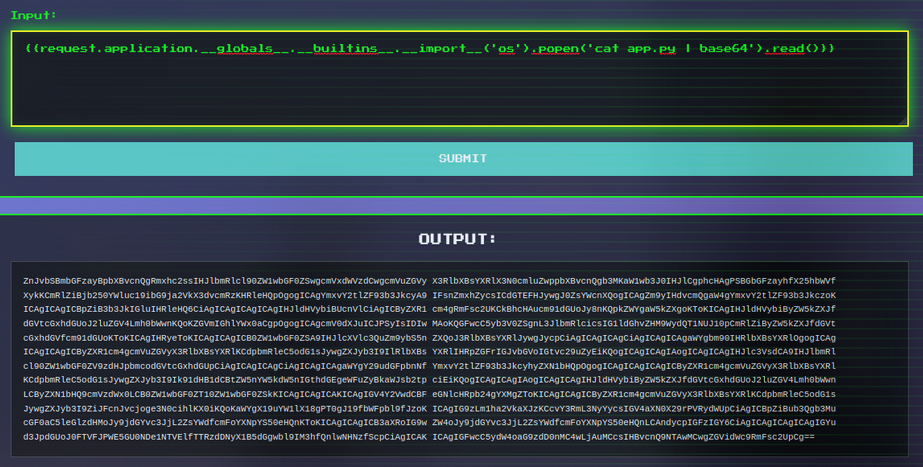
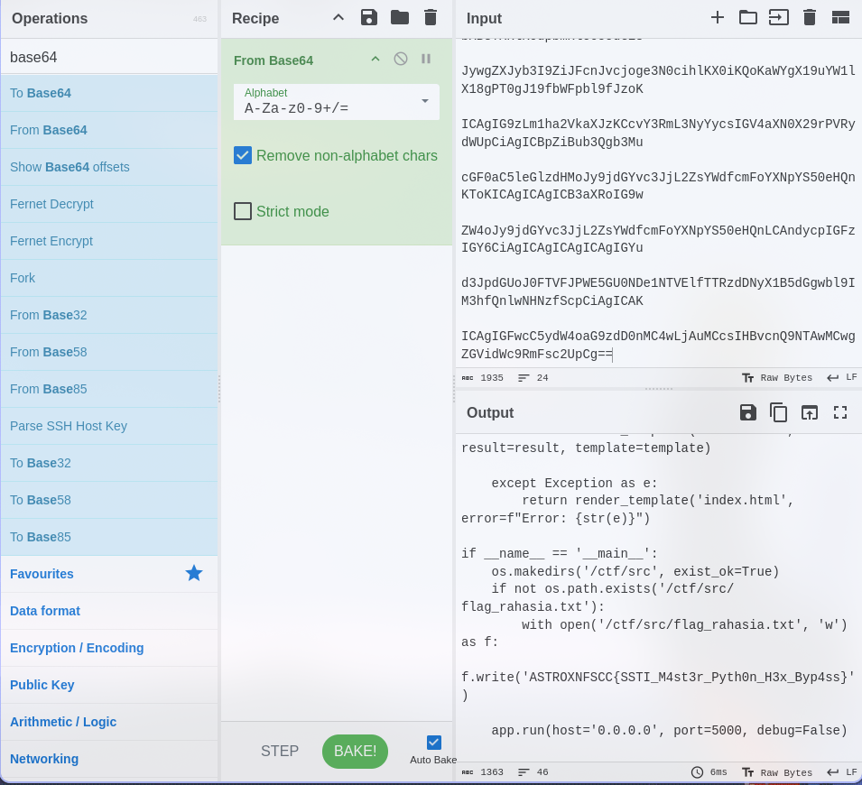

# Walkthrough
Diberikan suatu link website, yang memiliki form input, jadi gw langsung mencoba nya dengan SSTI payload `{{7*7}}`

Lalu gw mengambil referensi payload SSTI dari web ini (https://onsecurity.io/article/server-side-template-injection-with-jinja2/)

Dan gw berhasil untuk listing file current directory, tapi gw ga nemu flag.txt 

Lalu gw coba untuk melihat source dari `app.py`, tetapi

Terus gw coba untuk tetap cat `app.py` tetapi outputnya itu `base64`, kayak gini

sung decode

