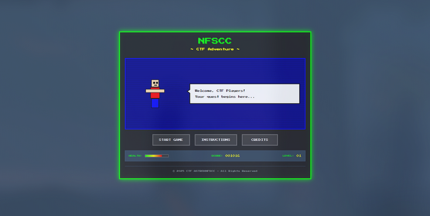
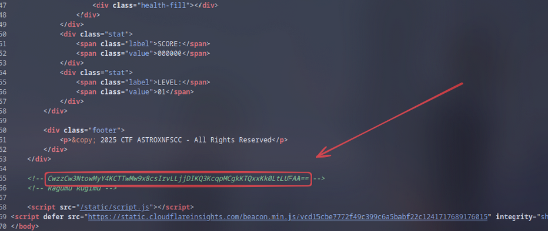
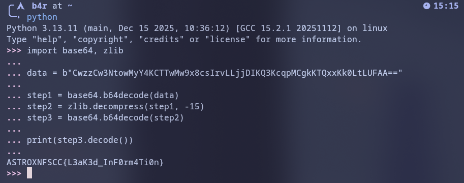

## Walkthrough

Diberikan sebuah link website, saat gw buka begini tampilannya




Lalu gw langsung meng-cek source code nya dan menemukan ini,




Langsung gw coba decode menggunakan script python berikut:
```py
import base64, zlib

data = b"CwzzCw3NtowMyY4KCTTwMw9x8csIrvLLjjDIKQ3KcqpMCgkKTQxxKk0LtLUFAA=="

step1 = base64.b64decode(data)
step2 = zlib.decompress(step1, -15)
step3 = base64.b64decode(step2)

print(step3.decode())
```

### Penjelasan Script
1. Decode menggunakan base64
2. Karna hasil decode yang aneh, gw mencoba untuk zlib deflate decompress dengan `windowsbits = -15`, lalu muncul output base64 lagi
3. Decode menggunakan base64 lagi


