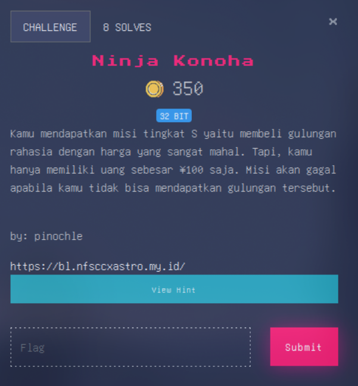
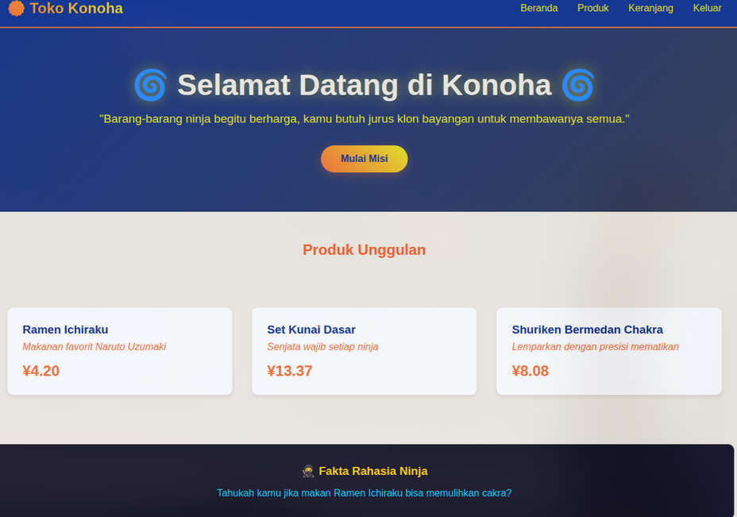
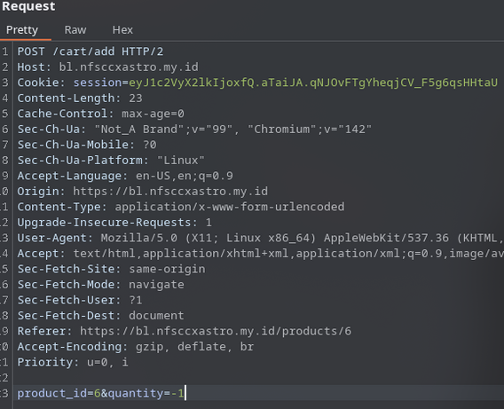
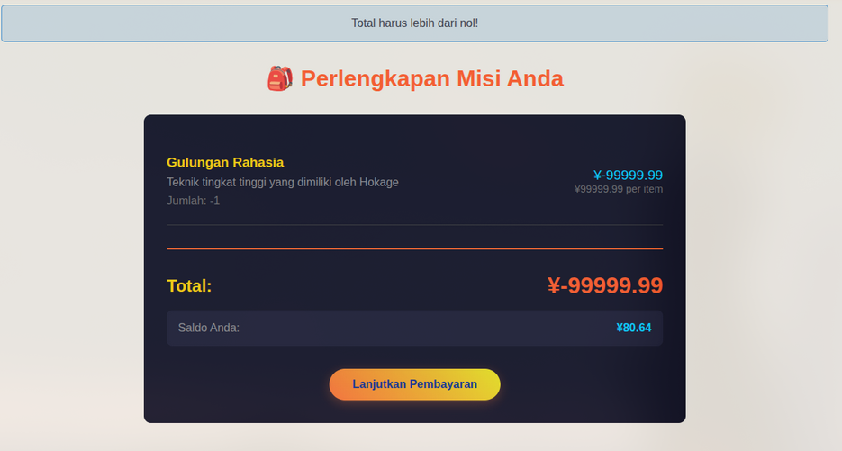
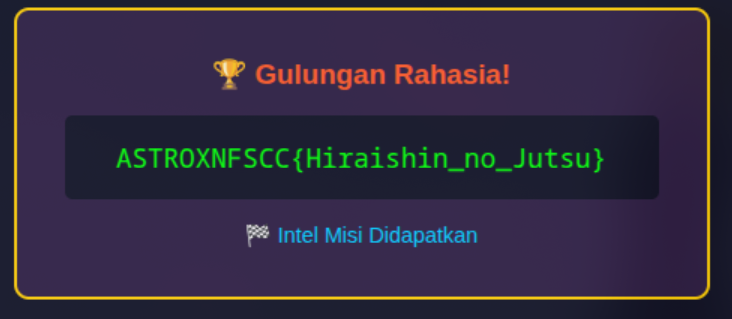

# Walkthrough

Diberikan sebuah link website, begini tampilannya

Terdapat fitur register dan login yang nampak tidak vulnerable, lalu gw mengcek bahwa di bagian produk terdapat  item “Gulungan Rahasia” yang memiliki harga paling mahal dan tentu saja gw yakin bahwa item itu adalah flag nya, dan dalam mekanisme web ini, gw perlu memcheckout barang itu,

Disini gw mencoba untuk mengutak-atik dibagian parameter quantity 

Disini berhasil, total item di keranjang menjadi minus, tetapi saat kami coba untuk mengcheckout terdapat alert

Bahwa total nya harus lebih dari 0, yang artinya terdapat validasi, disini untuk mengakalinya cukup gampang, yaitu dengan menambahkan beberapa barang-barang kecil sampai total nya berada di range uang 

Dan tinggal checkout

