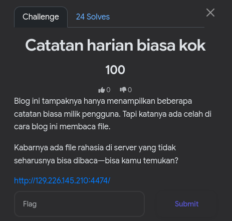
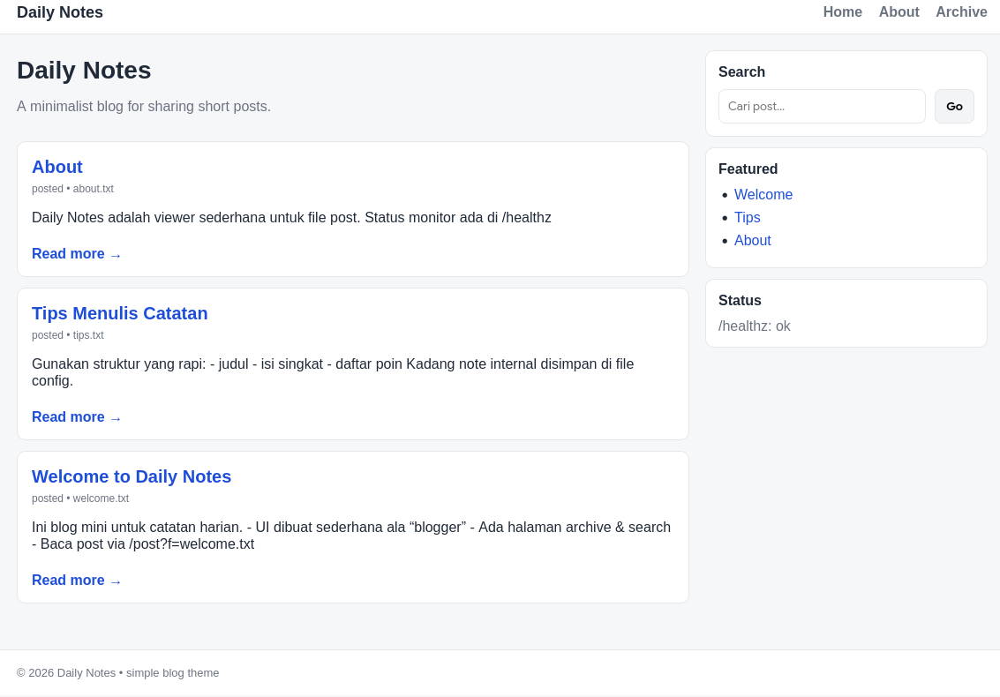
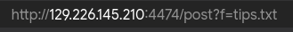
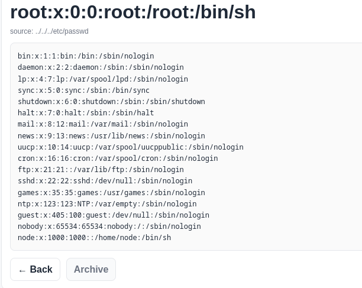
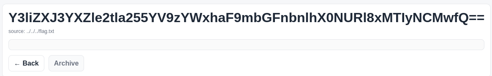

# Walktrough

DIberikan sebuah link website, begini tampilannya saat dibuka

di fitur search, kita dapat melihat bahwa web ini menggunakan parameter `q`

dan meload salah satu file yang tersedia, dan muncul parameter `f`

langsung masukin payload LFI dasar `../../../etc/passwd`

tinggal ganti `/etc/passwd` dengan `/flag.txt`

decode base64 nya

