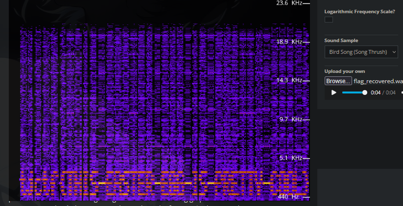

So we got 2 files, `albumcover.png` and encryptor

`enc.py`:
```py
import wave
from PIL import Image
import numpy as np
#sample_rate = 44100
with wave.open('flag.wav', 'rb') as w:
    frames = np.frombuffer(w.readframes(w.getnframes()), dtype=np.int16)
    print(w.getnframes())
    sampwidth = w.getsampwidth() # 2
    nchannels = w.getnchannels() # 1
    w.close()
arr = np.array(frames)
img = arr.reshape((441, 444))
img = (img + 32767) / 65535 * 255
img = img.astype(np.uint8)
img = Image.fromarray(img)
img = img.convert('L')
```
as you can see, the original file is `.wav`, the encryptor change it to `.png` file, all we can do is reverse it

`solver.py`:
```py
from PIL import Image
import numpy as np
import wave

img = Image.open('albumcover.png')
img_arr = np.array(img)
arr = img_arr.astype(np.float64)
arr = arr / 255.0
arr = arr * 65535.0
framerate = 44100 
nframes = len(frames)
comptype = "NONE"
compname = "not compressed"
with wave.open('flag_recovered.wav', 'wb') as w:
    w.setparams((nchannels, sampwidth, framerate, nframes, comptype, compname))       
    w.writeframes(frames.tobytes())
```
but if u play it, the audio is feels broken, so checked it with spectogram

