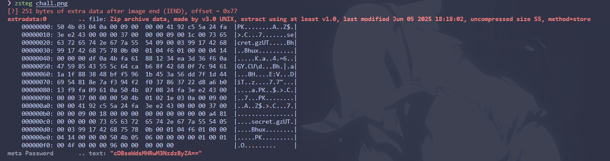
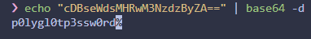
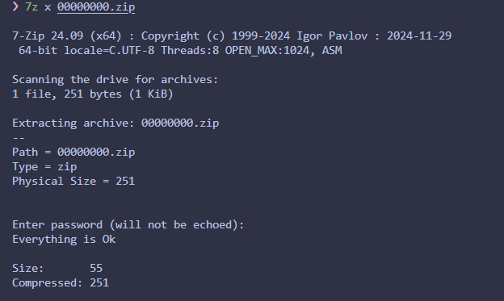

So we got a .png file, and the word `layers` is means we need to use `zsteg` again,

as you can see, there is zip file and also some `base64` pattern, so lets just decode the `base64` first,

then i dumped the zip file inside the image using `foremost` and extract it

we got a file called `secret.gz`, decompress it with command `gzip -d`, and u will get the flag
