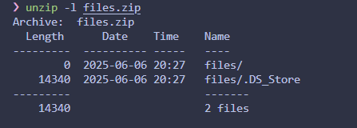

So we got a zip file,



after extracted, i got a file called `.DS_Store`

>A .DS_Store file, short for Desktop Services Store, is a hidden file on macOS that stores information about a folder's view settings, such as icon size, arrangement, and sorting. It's automatically created by the macOS Finder when you browse a folder and is usually invisible within the Finder itself

then i use online DS_Store Converter.
```
niZvI6zZ8yzoSl17d963mQIlocblob 0wnNJd_pKKNtfhG-HL8i Ns2Tpp4fQxW5zhYLLGIVdAIlocblob NUhhZkAZsgdvPVVF3KzZpAIlocblob p7s4fwmK70UDkM_ApzmX3AIlocblob PgbanHSdf0H3qDXVUrVAaAIlocblob PGjsQh7wml99RXiA-gta6QIlocblob pJ_ampVpcIVGVZErPVONDQIlocblob pm_TeJmHmlL-5Mdv3R1YoAIlocblob pMOW9YUc2Zrd-6B5G3-NSQIlocblob Po5jOoQ4HUssvLHuCmDj5gIlocblob pOGlM0FXA5tvruLyZ5AVRAIlocblob pPd8nFycxgq3SD67StjdCQIlocblob PqYOp2_ps2oErxR5U5uSXAIlocblob PrceMk6k6v8-gPc6YUfuvQIlocblob prsJSTpQJJX5eKJQF3akDgIlocblob PuAZy-41HFCOsKTCZkwDBwIlocblob QJWXuKXCsnG2mjGYYbyoaAIlocblob QLpbpFhcDb2oapdj3YgutgIlocblob Qs13PznBoQJC9yjgWm-clQIlocblob QzopSLFcXVCF5sII8C8jJAIlocblob r4NAxKJ_RMhOLA468CAuLQIlocblob rhnhvlSsjRdNv35ZYwqSMgIlocblob rkFwpUQRoffUQmfnqKFCNgIlocblob sOcYOUIJIYjTYFNud5htCAIlocblob sPEu3qqkuJDSVB6LZ0x82wIlocblob tCSdwHZsNBvNS3h4qih6tAIlocblob TibD2LWT-7Xua5Wmivc-6AIlocblob TM0MhKzOCDKMYolGyoYc3gIlocblob TxlnTHhAAyM7wIn3PGdLEgIlocblob Ur4ktp41Mmf49_FANNugHQIlocblob uvIo5poX5D2dGKif1JiWIAIlocblob uXcTlwm5yaS69kQd0YlYgQIlocblob V2XHU0KaptQFjruBnOeYJwIlocblob V3JQfigsgWSgJ2bu8IuPOQIlocblob vNgO1oK2Ft-Q_OVtcjk7ogIlocblob VRU6bDaPkqPqFxsfBjrPQAIlocblob VVa_NUjLLaMsO2_Jwko-SAIlocblob w1oE_3GO5OTRADuEQ9PqnwIlocblob W62TUuIfC_ma91QdMu4ISAIlocblob wzeP722FHEtirWHFJrgP2AIlocblob xcTHd2ZbYtO9LQ2fmaQo1QIlocblob XfjqZgZvquXzdnfbcMKQMAIlocblob Xnji8EXzCRLmKJvoAkZftAIlocblob yfmS9_zOUIcxfSY-obWMhgIlocblob ylFen4T5uMeqvJC6p8dfkAIlocblob yx7GMqzc5YejMzOO5F087gIlocblob Z3cpkGAUMlLgzQctzCo2ZgIlocblob -FumtF3yx-kSP11OD8mFPAIlocblob 0wnNJd_pKKNtfhG-HL8iJwIlocblob 1VmhSaBo9ymK5dUhB3cPEQIlocblob 1zp7dw6eF3co0VaPDKhUagIlocblob 27bCy1Bt-9nnLG4W8oxkNAIlocblob 4vsxjPs-c9hBNmmaE8HJ8QIlocblob 5rc69mw3DNjUvLolTrP3ewIlocblob 6zed3-nVA008etbNxGTNEQIlocblob 78ICY1U_sI9qqF6vv97RhAIlocblob 7AJTVqVtlVelnulrRMUCaQIlocblob 7P7nopvmQj2usona47YjSAIlocblob 7v9Vn8ci1_C1tyjKpOrDjAIlocblob 9lZ0k-7YFRkQu1QhA-d-DAIlocblob _KxyLnw2LZxOc0Tk9U0cigIlocblob A69F-dk9M1nQFfzi06gLPwIlocblob abvFjWgNkHKQYbaMyCjdlwIlocblob AFEvM2adjTHq0E8noIE0kwIlocblob aNHzuom-c5UIGbW5ceGc9gIlocblob aNPc9lG0gpLnRvGI2JPQMAIlocblob aXNfdXNlZnVsP30gICAgIAIlocblob b-PeUWwmlHzmh613ikEFWwIlocblob b0HMxEHbs7pA9uHtxRPPTQIlocblob Bg9XKyNnYRSpUIYeK_2knAIlocblob CE4CzpPMjNHuYeLi2dLNHgIlocblob CPyvVdX_ynvUTdxXWYr7MwIlocblob D0FvxLGtoba2wKJQQEjUKAIlocblob D3LWCMzIQyc12SQUw5uDnwIlocblob DFhc0ROB762T-pZvtdPFqAIlocblob dGpjdGZ7ZHNfc3RvcmVfIAIlocblob dtiqv7O15HVT3k4aL1sTDAIlocblob Dwv-qkn0QQLu8RlhwUNNeAIlocblob e1xUP4GStK_lTs2W6gEkPAIlocblob E6IuP9ouzpQDYXSNNdSyFwIlocblob E8tEXrVCNAqQmSji8cDWqQIlocblob eNSX5RnqD95dCp7TNI2zOgIlocblob eSRLCk2xqnpx1htFqlBAvwIlocblob f0wkaX7NmMMATw1grKXIywIlocblob FsmKr0zCKawO9TVNgKkVvAIlocblob FxWYnzxWEHMQGNLR_7uXRwIlocblob g8azPwD-y-_2VU-dmRK7IAIlocblob GQxeqKQR4yLZIz889h8awQIlocblob iHFj7XDSIesD-TJ-aSiTyAIlocblob jg1spCuL4Vix9bgpToP5HgIlocblob JuARuIvr7ZvOOpeJ9LTOvAIlocblob kAbgNCWwQGUZWFktiIIHeAIlocblob kfAVM8pkh2jSSeuP0uWGogIlocblob LWUOeeOqK7mlQOTJmSmwVAIlocblob LxtZhpBRiU8PSE4eXQZV0wIlocblob meMIlojtiqbBuHOGDYud_QIlocblob mLO_JmXEG0tcWougAWQ6QwIlocblob MnbgbJqhwFXlh_kKGIYLJQIlocblob N3lsvxkjSRnwIfz3Z7C5uwIlocblob n8KZj1W3tx2WIXg8HqtF3gIlocblob aNHzuom-c5UIGbW5ceGc9gIlocblob aNPc9lG0gpLnRvGI2JPQMAIlocblob aXNfdXNlZnVsP30gICAgIAIlocblob b-PeUWwmlHzmh613ikEFWwIlocblob b0HMxEHbs7pA9uHtxRPPTQIlocblob Bg9XKyNnYRSpUIYeK_2knAIlocblob CE4CzpPMjNHuYeLi2dLNHgIlocblob CPyvVdX_ynvUTdxXWYr7MwIlocblob D0FvxLGtoba2wKJQQEjUKAIlocblob D3LWCMzIQyc12SQUw5uDnwIlocblob
```
its base64!!, after ten minutes of decode it, i finally found the exact part!

`solver.py`:
```py
import base64

b1 = "dGpjdGZ7ZHNfc3RvcmVfI"
b2 = "aXNfdXNlZnVsP30gICAgI"

combined = b1 + b2
missing_padding = len(combined) % 4
if missing_padding:
    combined += '=' * (4 - missing_padding)

decoded_bytes = base64.b64decode(combined)
print(decoded_bytes.decode(errors="ignore"))
```