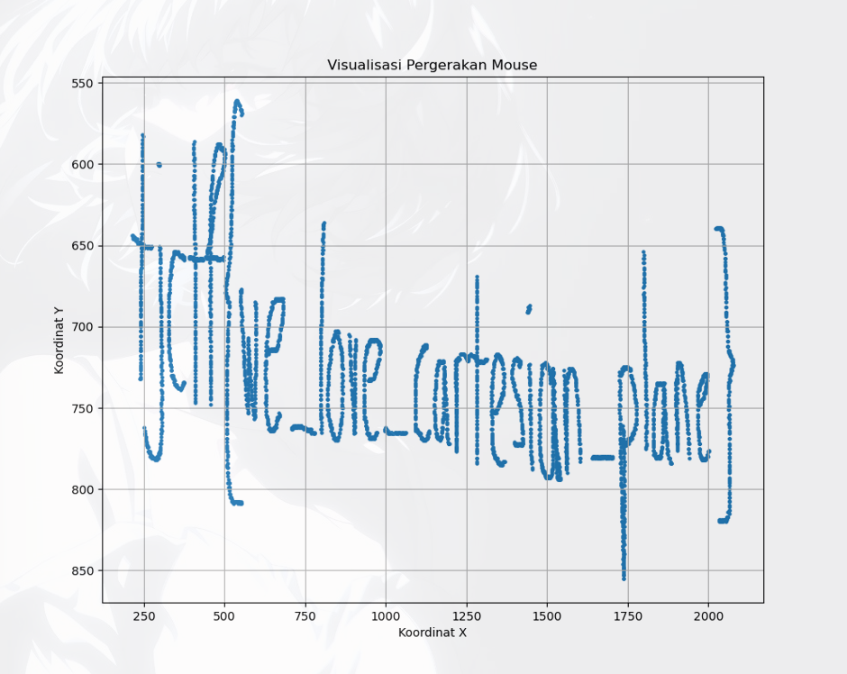

So we got a .txt file called `mouse_movements.txt`\
`mouse_movements.txt`:
```bash
❯ cat mouse_movements.txt | head

731,762

799,704

636,696

720,761

1703,781

1983,731

509,717

1732,802

595,744

556,702 
```
To solve this, we need an library called `matploitlib` for drawing plot from the data, and here it is the solver.
```py
import matplotlib.pyplot as plt

input_file = 'mouse_movements.txt'
x_coords = []
y_coords = []

try:
    with open(input_file, 'r') as f:
        for line in f:
            try:
                x, y = map(int, line.strip().split(','))
                x_coords.append(x)
                y_coords.append(y)
            except ValueError:
                print(f"Melewati baris yang tidak valid: {line.strip()}")

    plt.figure(figsize=(10, 8))
    plt.scatter(x_coords, y_coords, s=5) 
    plt.gca().invert_yaxis()
    plt.title('Visualisasi Pergerakan Mouse')
    plt.xlabel('Koordinat X')
    plt.ylabel('Koordinat Y')
    plt.grid(True)
    plt.savefig('mouse_plot.png')
    plt.show()
```

`output`:


