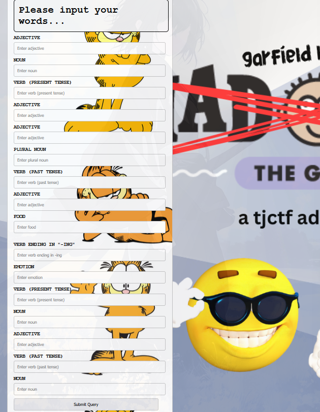
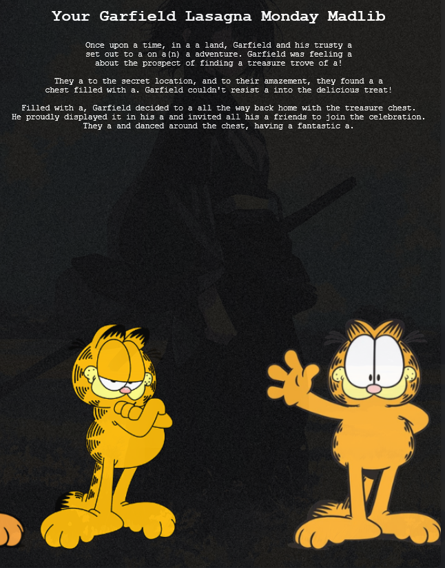
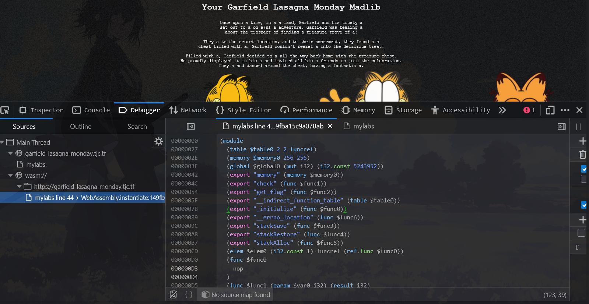

So we got a web,



In here, i just input random, and direct to `/mylabs`



and if u open the web debugger,



```c
(module
  (table $table0 2 2 funcref)
  (memory $memory0 256 256)
  (global $global0 (mut i32) (i32.const 5243952))
  (export "memory" (memory $memory0))
  (export "check" (func $func1))
  (export "get_flag" (func $func2))
  (export "__indirect_function_table" (table $table0))
  (export "_initialize" (func $func0))
  (export "__errno_location" (func $func6))
  (export "stackSave" (func $func3))
  (export "stackRestore" (func $func4))
  (export "stackAlloc" (func $func5))
  (elem $elem0 (i32.const 1) funcref (ref.func $func0))
  (func $func0
    nop
  )
  (func $func1 (param $var0 i32) (result i32)
    (local $var1 i32)
    block $label0
      local.get $var0
      i32.load8_u
      i32.const 98
      i32.ne
      br_if $label0
      local.get $var0
      i32.load8_u offset=1
      i32.const 108
      i32.ne
      br_if $label0
      local.get $var0
      i32.load8_u offset=2
      i32.const 117
      i32.ne
      br_if $label0
      local.get $var0
      i32.load8_u offset=3
      i32.const 101
      i32.ne
      br_if $label0
      local.get $var0
      i32.load8_u offset=4
      i32.const 124
      i32.ne
      br_if $label0
      local.get $var0
      i32.load8_u offset=5
      i32.const 116
      i32.ne
      br_if $label0
      local.get $var0
      i32.load8_u offset=6
      i32.const 117
      i32.ne
      br_if $label0
      local.get $var0
      i32.load8_u offset=7
      i32.const 120
      i32.ne
      br_if $label0
      local.get $var0
      i32.load8_u offset=8
      i32.const 101
      i32.ne
      br_if $label0
      local.get $var0
      i32.load8_u offset=9
      i32.const 100
      i32.ne
      br_if $label0
      local.get $var0
      i32.load8_u offset=10
      i32.const 111
      i32.ne
      br_if $label0
      local.get $var0
      i32.load8_u offset=11
      i32.const 124
      i32.ne
      br_if $label0
      local.get $var0
      i32.load8_u offset=12
      i32.const 100
      i32.ne
      br_if $label0
      local.get $var0
      i32.load8_u offset=13
      i32.const 97
      i32.ne
      br_if $label0
      local.get $var0
      i32.load8_u offset=14
      i32.const 110
      i32.ne
      br_if $label0
      local.get $var0
      i32.load8_u offset=15
      i32.const 99
      i32.ne
      br_if $label0
      local.get $var0
      i32.load8_u offset=16
      i32.const 101
      i32.ne
      br_if $label0
      local.get $var0
      i32.load8_u offset=17
      i32.const 124
      i32.ne
      br_if $label0
      local.get $var0
      i32.load8_u offset=18
      i32.const 99
      i32.ne
      br_if $label0
      local.get $var0
      i32.load8_u offset=19
      i32.const 104
      i32.ne
      br_if $label0
      local.get $var0
      i32.load8_u offset=20
      i32.const 97
      i32.ne
      br_if $label0
      local.get $var0
      i32.load8_u offset=21
      i32.const 111
      i32.ne
      br_if $label0
      local.get $var0
      i32.load8_u offset=22
      i32.const 115
      i32.ne
      br_if $label0
      local.get $var0
      i32.load8_u offset=23
      i32.const 124
      i32.ne
      br_if $label0
      local.get $var0
      i32.load8_u offset=24
      i32.const 112
      i32.ne
      br_if $label0
      local.get $var0
      i32.load8_u offset=25
      i32.const 97
      i32.ne
      br_if $label0
      local.get $var0
      i32.load8_u offset=26
      i32.const 110
      i32.ne
      br_if $label0
      local.get $var0
      i32.load8_u offset=27
      i32.const 99
      i32.ne
      br_if $label0
      local.get $var0
      i32.load8_u offset=28
      i32.const 97
      i32.ne
      br_if $label0
      local.get $var0
      i32.load8_u offset=29
      i32.const 107
      i32.ne
      br_if $label0
      local.get $var0
      i32.load8_u offset=30
      i32.const 101
      i32.ne
      br_if $label0
      local.get $var0
      i32.load8_u offset=31
      i32.const 115
      i32.ne
      br_if $label0
      local.get $var0
      i32.load8_u offset=32
      i32.eqz
      local.set $var1
    end $label0
    local.get $var1
  )
  (func $func2 (result i32)
    i32.const 1040
    i64.const 9038006696380691298
    i64.store
    i32.const 1032
    i64.const 7596551555448135522
    i64.store
    i32.const 1024
    i64.const 3708568498132445812
    i64.store
    i32.const 1048
    i32.const 0
    i32.store8
    i32.const 1024
  )
  (func $func3 (result i32)
    global.get $global0
  )
  (func $func4 (param $var0 i32)
    local.get $var0
    global.set $global0
  )
  (func $func5 (param $var0 i32) (result i32)
    global.get $global0
    local.get $var0
    i32.sub
    i32.const -16
    i32.and
    local.tee $var0
    global.set $global0
    local.get $var0
  )
  (func $func6 (result i32)
    i32.const 1056
  )
)
```
as you can see
```c
      i32.load8_u offset=1
      i32.const 108
      i32.ne
```
is ASCII code, if u decode it with `i32.load8_u offset=` 1-31, the output should be `blue|tuxedo|dance|chaos|pancakes`

then, we can try to input those chars,


