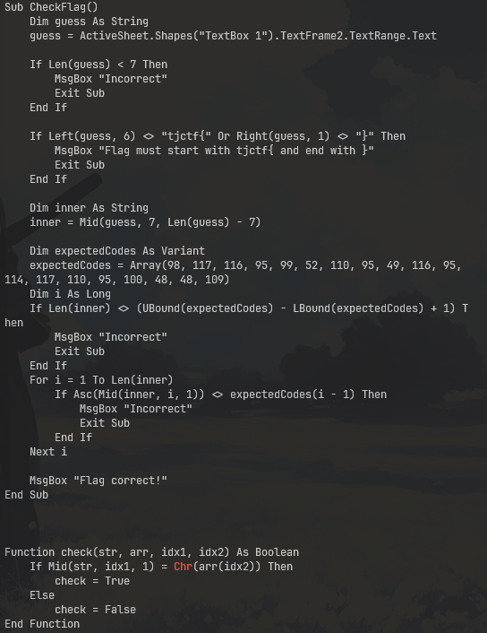

We got a xlsm file, this already indicates that there is something in the xlsm file, so we can just use `olevba` to extract 



```ruby
Sub CheckFlag()
    Dim guess As String
    guess = ActiveSheet.Shapes("TextBox 1").TextFrame2.TextRange.Text

    If Len(guess) < 7 Then
        MsgBox "Incorrect"
        Exit Sub
    End If

    If Left(guess, 6) <> "tjctf{" Or Right(guess, 1) <> "}" Then
        MsgBox "Flag must start with tjctf{ and end with }"
        Exit Sub
    End If

    Dim inner As String
    inner = Mid(guess, 7, Len(guess) - 7)

    Dim expectedCodes As Variant
    expectedCodes = Array(98, 117, 116, 95, 99, 52, 110, 95, 49, 116, 95, 114, 117, 110, 95, 100, 48, 48, 109)
    Dim i As Long
    If Len(inner) <> (UBound(expectedCodes) - LBound(expectedCodes) + 1) Then
        MsgBox "Incorrect"
        Exit Sub
    End If
    For i = 1 To Len(inner)
        If Asc(Mid(inner, i, 1)) <> expectedCodes(i - 1) Then
            MsgBox "Incorrect"
            Exit Sub
        End If
    Next i

    MsgBox "Flag correct!"
End Sub


Function check(str, arr, idx1, idx2) As Boolean
    If Mid(str, idx1, 1) = Chr(arr(idx2)) Then
        check = True
    Else
        check = False
End Function
```
to reconsturct the flag, as you can see here
```r
expectedCodes = Array(98, 117, 116, 95, 99, 52, 110, 95, 49, 116, 95, 114, 117, 110, 95, 100, 48, 48, 109)
```
it is just ASCII, and this is the solver
```py
expected_codes = [98, 117, 116, 95, 99, 52, 110, 95, 49, 116, 95, 114, 117, 110, 95, 100, 48, 48, 109]
inner_flag = "".join(chr(code) for code in expected_codes)
flag = f"tjctf{{{inner_flag}}}"
print(flag)
```