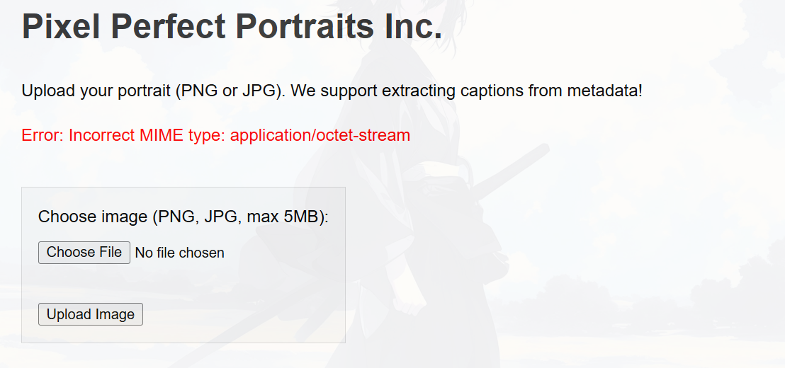
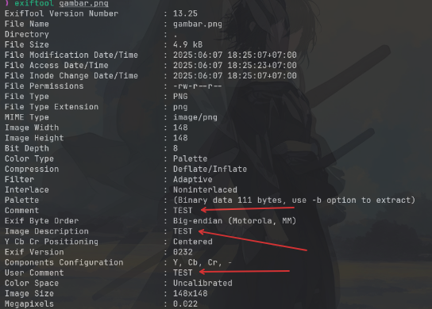
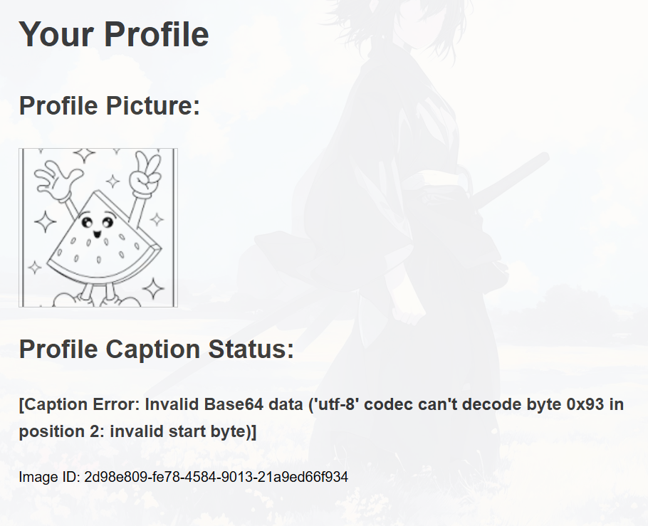
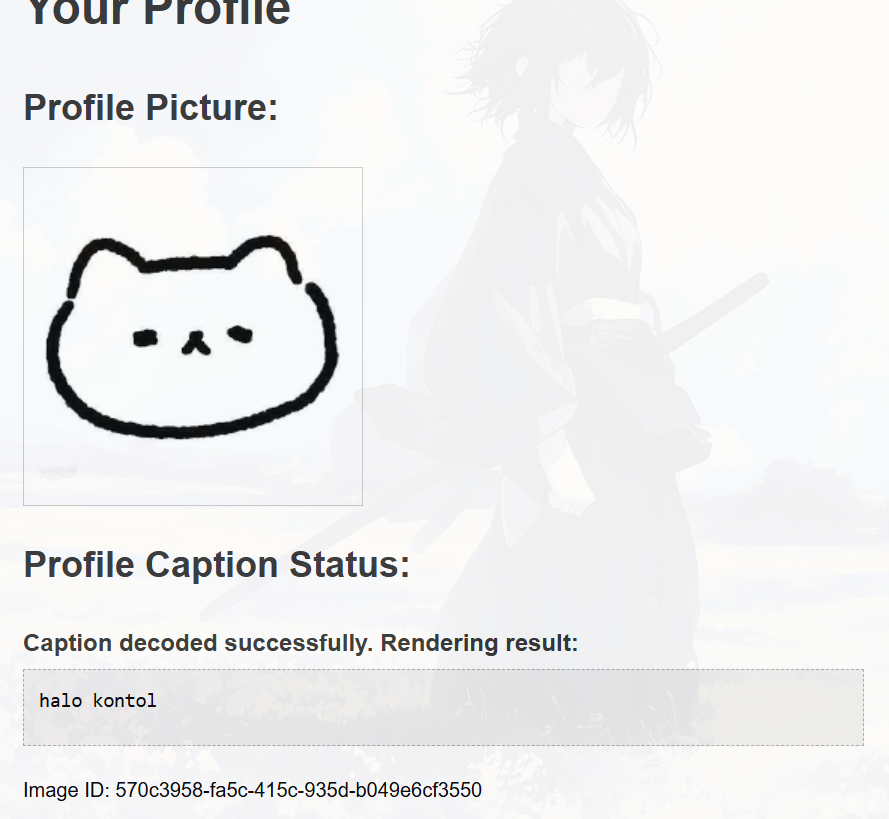
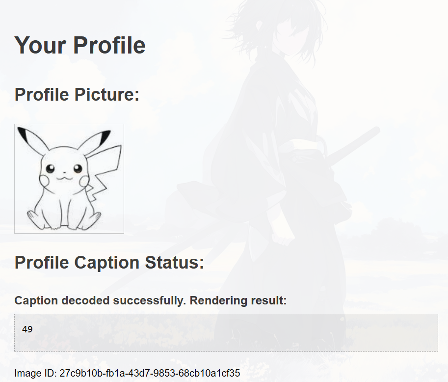
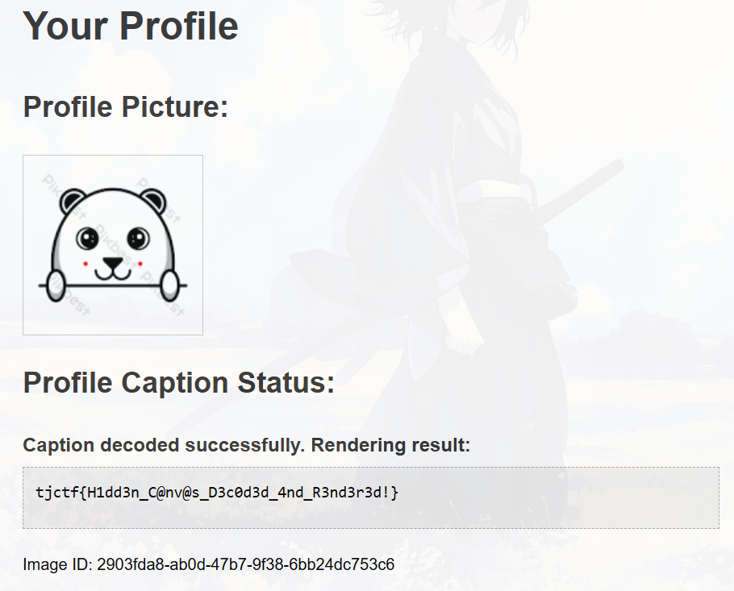

So we got a web serivce that can upload a image

Initially, I thought that we need to upload `webshell` with all its bypass techniques, but there is this one error that indicates that this is a vulnerability in file upload, but does not use `webshell`..

`Incorrect MIME type`, this indicates that the server is validating the image inputed by the user, so even though I have done all kinds of bypasses here from naming the webshell `webshell.jpg.php` to changing the magic byte, it still doesn't get through because the server validates all the content in the image entered by the user.

So here I try to just upload random image with the addition of variables in the metadata

`[Caption Error: Invalid Base64 data ('utf-8' codec can't decode byte 0x93 in position 2: invalid start byte)]` This shows that the server, in addition to extracting extra metadata on the image, also decodes it as base64, so the way to do this is by first encoding the payload in the metadata with base64

then now, i tried to test it with `SSTI` payload `{{7*7}}`

then use SSTI RCE payload `{{ cycler.__init__.__globals__.os.popen('ls').read() }}`

then cat the `flag.txt`

