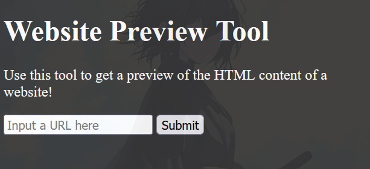
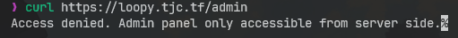
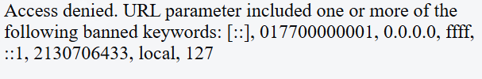
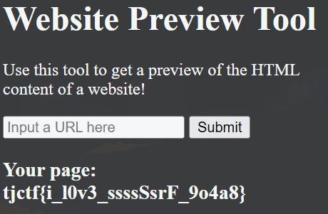

We are given a Web service "Website Preview Tool",

As it says in the desc, we need to access the admin page in port 5000 (to get the flag),

If you can understand the meaning of the desc, it indirectly tells you that this website has SSRF vulnerability

So, we can try to input like `localhost:5000/admin` but, the server banned it,

but we can still use `0` as local IP, so the payload is `http://0:5000/admin`

